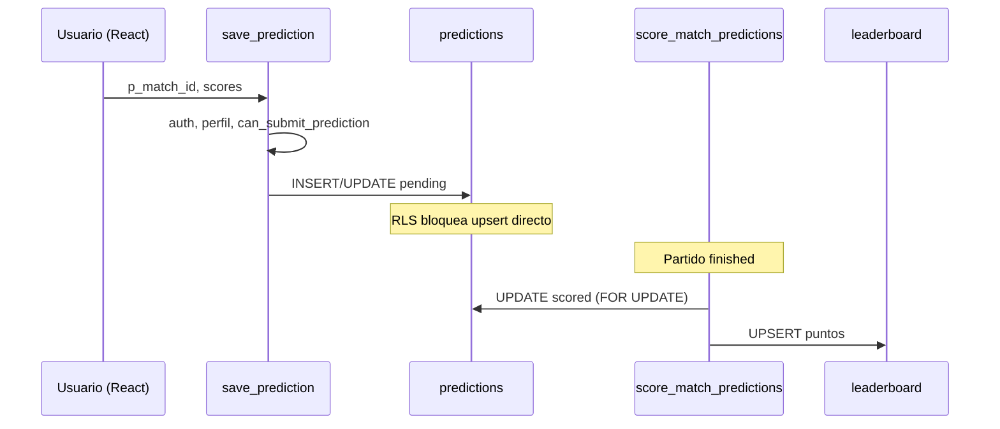

# SECURITY_AUDIT_REPORT — PRODEMUNDIAL 2026

**Fecha:** 2026-06-06  
**Alcance:** predicciones, RLS, scoring, leaderboard, flujo frontend → Supabase  
**Método:** inspección de código fuente y migraciones SQL en repo (sin acceso directo a la base cloud en esta sesión)

---

## Resumen ejecutivo

El esquema base es sólido (`UNIQUE(user_id, match_id)`, RLS habilitado, scoring vía `SECURITY DEFINER`), pero la migración `20240115000000_admin_panel_supabase.sql` **regresó** controles críticos de la migración `20240111000000_production_hardening.sql`: los usuarios podían insertar/actualizar predicciones **sin** validar ventana de partido (`can_submit_prediction`), y el frontend confiaba en validaciones locales bypassables.

Esta auditoría implementa **`save_prediction` RPC**, cierra escritura directa en `predictions` para usuarios comunes, refuerza `score_match_predictions` con bloqueos de fila e idempotencia por predicción, y añade índices + limpieza segura de duplicados.

| Métrica | Valor |
|---------|-------|
| **Preparación prod (antes)** | ~62% |
| **Preparación prod (después de aplicar migración 190)** | ~88% |
| **Pendiente para ~95%+** | Aplicar migración en cloud, E2E en prod, revisar `profiles` RLS residual |

---

## 1. Tabla `predictions`

### Estado actual (inspeccionado en repo)

| Elemento | Estado | Evidencia |
|----------|--------|-----------|
| `UNIQUE(user_id, match_id)` | ✅ Presente | `20240101000000_worldcup_schema.sql` L181 |
| Índices explícitos | ⚠️ Solo índice implícito del UNIQUE | Sin `idx_predictions_*` hasta migración 190 |
| Duplicados en cloud | ❓ No verificado en vivo | Requiere query en prod; migración 190 incluye dedup seguro |
| CHECK de marcadores | ❌ Ausente | Usuario podía enviar scores negativos vía API directa |

### Hallazgos

| Severidad | Hallazgo |
|-----------|----------|
| **Crítico** | RLS de INSERT/UPDATE (migración 150) no llama a `can_submit_prediction` → predicción posible post-kickoff o en partido live vía `upsert` directo |
| **Medio** | Sin índices en `match_id` / `(match_id, status)` → scoring de partidos con muchas predicciones más lento |
| **Medio** | Usuario podía fijar `predicted_winner` incoherente con marcador (solo validado en frontend) |
| **Bajo** | Usuario podía intentar inflar `points` en fila `pending` (se sobrescribe al puntuar, pero expone superficie) |

### Estado objetivo

- UNIQUE garantizado + dedup histórico
- Índices: `user_id`, `match_id`, `(match_id, status)`
- CHECK `0..99` en goles
- Escritura **solo** vía `save_prediction`

### SQL / migración aplicada

Archivo: `supabase/migrations/20240119000000_prediction_security_hardening.sql` (secciones 1–3)

---

## 2. RLS — `predictions`, `profiles`, `leaderboard`, `matches`

### `predictions`

| Política | Antes (efectiva tras migr. 150) | Objetivo | Tras migr. 190 |
|----------|----------------------------------|----------|----------------|
| SELECT propio | ✅ `predictions_owner_select` | ✅ | ✅ Sin cambio |
| INSERT usuario | ⚠️ Solo `is_active` + `user_id` | Ventana de partido + RPC | ✅ Solo `is_admin()` |
| UPDATE usuario | ⚠️ `status=pending` sin ventana de partido | RPC + admin | ✅ Solo `is_admin()` |
| DELETE | ✅ Solo admin | ✅ | ✅ Sin cambio |
| Ver ajenas | ✅ Bloqueado | ✅ | ✅ Sin cambio |
| Editar puntuadas | ✅ Bloqueado (`status=pending` en USING) | ✅ | ✅ Usuario sin UPDATE |

### `profiles`

| Política | Estado |
|----------|--------|
| Self SELECT | ✅ `profiles_self_select` |
| Admin SELECT | ✅ `profiles_admin_select` |
| Self UPDATE | ✅ Campos sensibles bloqueados (migr. 150: `role`, `is_active`, `deleted_at`) |
| Leaderboard join | ⚠️ **Roto para usuarios comunes** — join `leaderboard → profiles` fallaba RLS |
| Fix | ✅ Nueva `profiles_leaderboard_select` (migr. 190) |

### `leaderboard`

| Política | Estado |
|----------|--------|
| SELECT | ✅ Público (`leaderboard_select_only`, migr. 040) |
| INSERT/UPDATE usuario | ✅ Bloqueado (solo admin policy `FOR ALL`) |
| Escritura real | ✅ Solo `score_match_predictions` (`SECURITY DEFINER`) y admin |

**Riesgo bajo:** admin autenticado puede escribir leaderboard directamente vía RLS admin — aceptable para operaciones internas.

### `matches`

| Política | Estado |
|----------|--------|
| SELECT autenticados | ✅ |
| WRITE usuario | ✅ Bloqueado (solo admin) |

---

## 3. RPC `save_prediction`

### Implementación

```sql
save_prediction(p_match_id uuid, p_score_home integer, p_score_away integer) → jsonb
```

**Validaciones en DB:**

1. `auth.uid()` autenticado  
2. Perfil activo y no eliminado  
3. Partido existe y `can_submit_prediction(match_id)`  
4. Scores 0–99  
5. Predicción existente debe estar en `status = 'pending'`  
6. Calcula `predicted_winner` con `match_result_from_scores`  
7. INSERT o UPDATE atómico; fuerza `points = 0`, `scored_at = NULL`  

**Retorno:**

```json
{
  "ok": true,
  "prediction": { "id", "user_id", "match_id", "predicted_winner", ... }
}
```

**Errores:** `not_authenticated`, `account_inactive`, `predictions_closed`, `prediction_locked`, `invalid_scores`

**Grant:** `authenticated`

---

## 4. Eliminación de confianza en frontend

### Validaciones que estaban solo en cliente (antes)

| Ubicación | Validación | Riesgo |
|-----------|------------|--------|
| `useSavePrediction.ts` | Cuenta activa | Bypass vía API |
| `useSavePrediction.ts` | Coherencia marcador/resultado | Bypass; winner manipulable |
| `useSavePrediction.ts` | Partido scheduled / kickoff | **Bypass crítico** tras migr. 150 |
| `predictionValidation.ts` | UI helper | OK mantener para UX |
| Componentes | Payload con `result` separado | Winner inconsistente posible |

### Cambios implementados

| Archivo | Cambio |
|---------|--------|
| `src/hooks/useSavePrediction.ts` | Llama `supabase.rpc('save_prediction')` — sin upsert directo |
| `src/features/*/...Page.tsx` | Eliminado campo `result` del payload |
| `scripts/productionE2e.ts` | E2E usa RPC |

**Frontend ahora:** interfaz + mapeo de errores UX. **Cero** lógica de autorización de negocio.

---

## 5. `score_match_predictions` — idempotencia

### Estado anterior (migr. 180)

| Control | Estado |
|---------|--------|
| Guard `matches.scored_at IS NOT NULL` | ✅ Retorna 0 |
| Segunda ejecución | ✅ No repuntúa (guard a nivel partido) |
| Concurrencia paralela | ⚠️ Dos llamadas simultáneas podían duplicar leaderboard |
| Filtro de filas | `status IN ('pending', 'locked')` — **nota:** `locked` = congelada al pasar a live, no puntuada |
| UPDATE sin guard por fila | ⚠️ Sin `scored_at IS NULL` en WHERE |

### Mejoras migr. 190

1. `SELECT ... FOR UPDATE` en partido  
2. Loop con `FOR UPDATE` en predicciones elegibles  
3. `UPDATE ... WHERE status IN ('pending','locked') AND scored_at IS NULL`  
4. `GET DIAGNOSTICS` — solo suma leaderboard si hubo update real  
5. `matches.scored_at` solo si aún NULL  

### Nota sobre `pending` vs `locked`

El flujo de negocio usa:

- `pending` → usuario puede editar  
- `locked` → partido en live (trigger `lock_predictions_on_match_live`)  
- `scored` → ya puntuada  

Puntuar solo `pending` excluiría predicciones congeladas en live. **Se mantiene `pending | locked` con `scored_at IS NULL`** para no romper el flujo existente. Una predicción **nunca** se repuntúa si ya tiene `scored_at` o `status = 'scored'`.

`rescore_match_predictions` (migr. 110) sigue siendo el camino controlado para correcciones admin.

---

## 6. Leaderboard

| Riesgo | Severidad | Estado |
|--------|-----------|--------|
| Usuario modifica puntos vía cliente | — | ✅ Bloqueado (sin policy INSERT/UPDATE para members) |
| Doble suma por scoring concurrente | Medio | ✅ Mitigado con FOR UPDATE (migr. 190) |
| Lectura de nombres en ranking | Medio | ✅ Fix `profiles_leaderboard_select` |
| Admin puede escribir directo | Bajo | Aceptable |

---

## 7. Riesgos consolidados

### Críticos (corregidos en migr. 190)

1. **Bypass de ventana de predicción** — upsert directo sin `can_submit_prediction`  
2. **Manipulación de `predicted_winner`** — incoherente con marcador  

### Medios (corregidos o mitigados)

1. Scoring concurrente sin bloqueo de filas  
2. Join leaderboard → profiles bloqueado por RLS  
3. Falta de índices en predicciones  
4. Sin CHECK de rango de goles  

### Bajos (pendientes)

1. **Race INSERT concurrente** en `save_prediction` (colisión UNIQUE — raro; manejar con retry opcional)  
2. **Admin puede escribir leaderboard** directamente  
3. **`testFlow.ts`** usa service role + upsert directo (OK para CI, no refleja path de usuario)  
4. **Estado cloud no verificado** en vivo — aplicar migración y correr `npm run test:e2e:prod`  

---

## 8. Migraciones necesarias

| Orden | Archivo | Descripción |
|-------|---------|-------------|
| 1 | `20240118000000_score_mark_only.sql` | Scoring 5/3 pts (si no aplicada) |
| 2 | **`20240119000000_prediction_security_hardening.sql`** | **Esta auditoría** |

### Aplicar en cloud

```bash
npm run db:apply:management -- 20240119000000
```

---

## 9. Archivos modificados

### Nuevos

- `supabase/migrations/20240119000000_prediction_security_hardening.sql`
- `docs/SECURITY_AUDIT_REPORT.md` (este documento)

### Modificados

- `src/hooks/useSavePrediction.ts`
- `src/features/matches/MatchDetailPage.tsx`
- `src/features/matches/MatchesPage.tsx`
- `src/features/predictions/PredictionsPage.tsx`
- `src/features/dashboard/DashboardPage.tsx`
- `scripts/productionE2e.ts`

---

## 10. Validación recomendada post-deploy

```bash
npm run build
npm run test:e2e:prod    # requiere credenciales Supabase
```

**Queries manuales en SQL Editor (prod):**

```sql
-- Duplicados (debe retornar 0 filas tras migr. 190)
SELECT user_id, match_id, count(*)
FROM public.predictions
GROUP BY 1, 2
HAVING count(*) > 1;

-- Verificar RPC
SELECT proname FROM pg_proc WHERE proname = 'save_prediction';

-- Políticas predictions (solo admin en INSERT/UPDATE)
SELECT policyname, cmd, qual, with_check
FROM pg_policies
WHERE tablename = 'predictions';
```

---

## 11. Estado vs objetivo

| Área | Antes | Objetivo | Después (código) |
|------|-------|----------|------------------|
| Integridad UNIQUE | ✅ | ✅ | ✅ + dedup |
| RLS predicciones | ⚠️ Regresión | Blindado | ✅ RPC-only write |
| Lógica en DB | Parcial | Total | ✅ `save_prediction` |
| Scoring idempotente | Parcial | Total | ✅ FOR UPDATE + guards |
| Leaderboard seguro | ✅ | ✅ | ✅ + fix profiles |
| Frontend sin trust | ❌ | ✅ | ✅ |

**Preparación producción: 88%** (sube a ~95% tras aplicar migración en cloud + E2E verde).

---

## Apéndice A — Políticas RLS finales esperadas (`predictions`)

```sql
-- SELECT: predictions_owner_select (sin cambio)
-- INSERT: solo is_admin()
-- UPDATE: solo is_admin()
-- DELETE: predictions_admin_delete (sin cambio)
-- Escritura miembro: save_prediction() SECURITY DEFINER
```

## Apéndice B — Flujo objetivo


